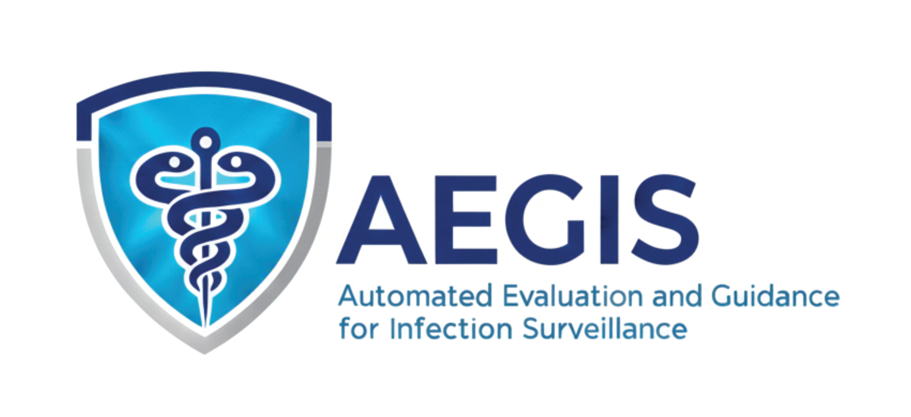

<p align="center">
  
</p>

# AEGIS

**Automated Evaluation and Guidance for Infection Surveillance**

AEGIS is an intelligent clinical decision support platform for Antimicrobial Stewardship (ASP) and Infection Prevention (IP) teams. By integrating real-time EHR data from FHIR and Clarity with machine learning and AI, AEGIS aims to:

- **Detect** healthcare-associated infections (HAIs) in real-time using automated surveillance
- **Alert** on serious infections with inadequate antimicrobial coverage
- **Predict** infection risk using ML models to enable proactive prevention
- **Monitor** antimicrobial usage patterns and alert on opportunities for optimization
- **Report** to NHSN with automated HAI classification, antibiotic usage (AU), and antimicrobial resistance (AR) reporting
- **Reduce** manual chart review burden through AI-assisted clinical extraction

Our vision is to shift infection prevention from reactive detection to proactive risk assessment—identifying high-risk patients before infections occur and providing actionable guidance to clinicians at the point of care.

> **Disclaimer:** All patient data in this repository is **simulated** and was generated using [Synthea](https://github.com/synthetichealth/synthea) or custom test data generators. **No actual patient data exists in this repository.** Any resemblance to real patients is coincidental.

> **Epic Compatibility:** AEGIS is built against synthetic data that mirrors the structure of Epic's FHIR R4 API and Clarity data warehouse. This design allows the codebase to be readily deployed against live Epic environments with minimal configuration changes.

## Live Demo

**AEGIS Landing Page:** [https://aegis-asp.com](https://aegis-asp.com)

The landing page provides access to the following modules:

| Section | URL | Description |
|---------|-----|-------------|
| **ABX Approvals** | [/abx-approvals/](https://aegis-asp.com/abx-approvals/) | Phone-based antibiotic approval workflow with duration tracking and auto re-approval |
| **ASP Alerts** | [/asp-alerts/](https://aegis-asp.com/asp-alerts/) | Antimicrobial stewardship alerts (bacteremia, usage, indications) |
| **Drug-Bug Mismatch** | [/drug-bug-mismatch/](https://aegis-asp.com/drug-bug-mismatch/) | Real-time therapy-organism mismatch detection |
| **Antibiotic Indications** | [/abx-indications/](https://aegis-asp.com/abx-indications/) | LLM-based indication extraction and appropriateness assessment |
| **HAI Detection** | [/hai-detection/](https://aegis-asp.com/hai-detection/) | All 5 HAI types: CLABSI, SSI, CAUTI, VAE, CDI |
| **MDRO Surveillance** | [/mdro-surveillance/](https://aegis-asp.com/mdro-surveillance/) | Multi-drug resistant organism tracking |
| **Outbreak Detection** | [/outbreak-detection/](https://aegis-asp.com/outbreak-detection/) | Cluster detection and investigation |
| **NHSN Reporting** | [/nhsn-reporting/](https://aegis-asp.com/nhsn-reporting/) | AU, AR, and HAI data aggregation with NHSN submission |
| **Surgical Prophylaxis** | [/surgical-prophylaxis/](https://aegis-asp.com/surgical-prophylaxis/) | Perioperative antibiotic compliance evaluation |
| **Guideline Adherence** | [/guideline-adherence/](https://aegis-asp.com/guideline-adherence/) | Bundle compliance monitoring (Sepsis, Febrile Infant, CAP, etc.) |
| **Action Analytics** | [/action-analytics/](https://aegis-asp.com/action-analytics/) | Cross-module ASP/IP action tracking and workload analysis |
| **Dashboards** | [/dashboards/](https://aegis-asp.com/dashboards/) | Analytics dashboards for trends and operational insights |

The demo environment includes synthetic patient data for testing all module workflows.

## Architecture

```
aegis/
├── common/                         # Shared infrastructure
│   ├── channels/                   # Email, Teams webhooks
│   ├── alert_store/                # Persistent alert tracking (SQLite)
│   ├── abx_approvals/              # Antibiotic approval request storage
│   └── metrics_store/              # Provider activity, sessions, daily snapshots
├── dashboard/                      # Web dashboard (13 modules)
├── asp-bacteremia-alerts/          # Blood culture coverage monitoring
├── antimicrobial-usage-alerts/     # Broad-spectrum usage monitoring
├── guideline-adherence/            # Real-time guideline bundle monitoring
├── surgical-prophylaxis/           # Surgical prophylaxis compliance
├── hai-detection/                  # HAI candidate detection (5 types), LLM extraction, IP review
├── nhsn-reporting/                 # AU/AR reporting, NHSN submission
├── drug-bug-mismatch/              # Therapy-organism mismatch detection
├── mdro-surveillance/              # Multi-drug resistant organism tracking
├── outbreak-detection/             # Cluster detection and investigation
├── validation/                     # LLM extraction validation framework
├── scripts/                        # Demo and utility scripts
└── docs/                           # Documentation
```

## Current Modules

### asp-bacteremia-alerts

Real-time monitoring of blood culture results with antibiotic coverage assessment. Alerts ASP team when patients have positive cultures without appropriate antimicrobial coverage.

**Features:**
- FHIR R4 integration (HAPI FHIR for dev, Epic for production)
- Coverage rules for common pathogens (MRSA, VRE, Pseudomonas, Candida, etc.)
- Gram stain-based empiric coverage recommendations
- Multi-channel alerts: Email, Microsoft Teams with action buttons
- **Clinical data links** - Direct access to culture susceptibilities and patient medications from alerts

**Clinical Data Pages:**
| Page | URL | Description |
|------|-----|-------------|
| Culture Results | `/asp-alerts/culture/{id}` | Organism with susceptibility panel (S/I/R, MIC values) |
| Patient Medications | `/asp-alerts/patient/{id}/medications` | Current antibiotic orders |

**[Documentation →](asp-bacteremia-alerts/README.md)**

### antimicrobial-usage-alerts

Monitors antimicrobial usage patterns including broad-spectrum duration and antibiotic indication documentation. Provides two monitoring capabilities:

**Broad-Spectrum Duration Monitoring:**
- Alerts when meropenem, vancomycin, or other monitored antibiotics exceed configurable thresholds (default 72 hours)
- Severity escalation (warning at threshold, critical at 2x threshold)

**Antibiotic Indication Monitoring:**
- Extracts clinical syndrome/indication from notes (e.g., "CAP", "UTI", "sepsis")
- Compares prescribed agent to local guidelines for that syndrome
- LLM extraction from clinical notes for indication identification
- Only cases with no documented indication or guideline discordance generate ASP alerts
- Supports nightly batch runs via cron

> **Note:** Per Joint Commission MM.09.01.01 EP 13-15, the required "indication" is the clinical syndrome (e.g., "community-acquired pneumonia"), NOT an ICD-10 code. See [docs/ABX_INDICATION_JC_REQUIREMENTS.md](docs/ABX_INDICATION_JC_REQUIREMENTS.md) for details.

**Features:**
- Duration-based alerting for broad-spectrum antibiotics
- LLM-based indication extraction from clinical notes
- Configurable thresholds and monitored medications
- Teams alerts with acknowledge/snooze buttons
- Override tracking for pharmacist disagreements

**[Documentation →](antimicrobial-usage-alerts/README.md)**

### antibiotic-approvals

Phone-based antibiotic approval workflow for pharmacists handling prospective review requests. When prescribers call requesting extended use of broad-spectrum antibiotics (e.g., meropenem past 72 hours), pharmacists use this module to review clinical context and document decisions.

**Features:**
- Patient search by MRN or name via FHIR
- **Clinical context display** - MDR history, drug allergies, renal function
- Current antibiotics and recent culture susceptibilities
- Allergy-aware susceptibility flagging
- Duration tracking with predefined and custom approval periods
- Automatic re-approval workflow (cron-based scheduler, 3x daily)
- Approval chain tracking (1st, 2nd, 3rd re-approvals)
- Decision tracking (7 types: Approved, Suggested Alternate, Suggested Discontinue, etc.)
- Audit trail for compliance reporting
- Analytics dashboard with approval and re-approval metrics

**Clinical Alerts:**
| Alert Type | Description |
|------------|-------------|
| **MDR History** | MRSA, VRE, CRE, ESBL from past year cultures |
| **Drug Allergies** | Documented allergies with severity (anaphylaxis flagged) |
| **Renal Function** | CKD stage, dialysis status, GFR for dose adjustments |

**Workflow:**
1. Receive call from prescriber
2. Search patient by MRN
3. Review clinical alerts and culture data
4. Enter antibiotic and duration
5. Make and document decision

**[Documentation →](docs/abx-approvals.md)**

### guideline-adherence

Real-time monitoring of evidence-based clinical guideline bundles. Generates **GUIDELINE_DEVIATION** alerts when bundle elements are not completed within their time windows, and tracks aggregate compliance metrics for quality improvement and Joint Commission reporting.

**Supported Bundles (7):**
| Bundle | Elements | Key Metrics |
|--------|----------|-------------|
| **Pediatric Sepsis (CMS SEP-1)** | 6 | Blood culture, lactate, ABX ≤1h, fluids, reassessment |
| **Febrile Infant (AAP 2021)** | 12 | UA, blood cx, inflammatory markers, LP (age-stratified) |
| **Pediatric CAP** | 6 | CXR, SpO2, empiric choice, duration ≤7d |
| **Febrile Neutropenia** | 6 | Cultures, ABX ≤1h, risk stratification |
| **Surgical Prophylaxis** | 5 | Agent selection, timing ≤60min, duration ≤24h |
| **Pediatric UTI** | 7 | UA, culture, empiric choice, imaging |
| **SSTI/Cellulitis** | 6 | Margins marked, MRSA coverage, I&D if needed |

**Features:**
- Age-stratified logic for Febrile Infant bundle (8-21d, 22-28d, 29-60d per AAP 2021)
- Inflammatory marker threshold evaluation (PCT, ANC, CRP)
- FHIR-based real-time monitoring
- Integration with ASP Alerts queue
- Compliance metrics dashboard

**[Documentation →](guideline-adherence/README.md)**

### surgical-prophylaxis

Automated monitoring of surgical antimicrobial prophylaxis compliance following ASHP/IDSA/SHEA/SIS guidelines. Evaluates surgical cases against a 6-element bundle and generates **SURGICAL_PROPHYLAXIS** alerts for non-compliant cases.

**Bundle Elements (6):**
| Element | Description | Threshold |
|---------|-------------|-----------|
| **Indication** | Prophylaxis given/withheld appropriately | Per CPT code |
| **Agent Selection** | Correct antibiotic for procedure | Per guidelines |
| **Timing** | Administered before incision | ≤60 min (120 for vanco) |
| **Dosing** | Weight-based dosing | ±10% of calculated |
| **Redosing** | Intraop redose for long surgery | Per interval (4h cefazolin) |
| **Discontinuation** | Stopped after surgery | ≤24h (48h cardiac) |

**Features:**
- CPT code-based procedure identification (55+ procedures, 11 categories)
- Allergy-aware agent selection (beta-lactam alternatives)
- MRSA colonization screening integration
- Pediatric and adult dosing tables
- Integration with ASP Alerts queue

**Future Enhancements:**
- Real-time pre-operative alerting via Epic Secure Chat
- Alert when patient arrives in OR without prophylaxis
- SSI outcome correlation

**[Documentation →](surgical-prophylaxis/README.md)**

### hai-detection

Healthcare-Associated Infection (HAI) candidate detection, LLM-assisted classification, and IP review workflow. Uses rule-based screening combined with LLM fact extraction and deterministic NHSN rules to identify HAI candidates.

**Features:**
- **All 5 HAI types** - CLABSI, SSI, CAUTI, VAE, CDI per CDC/NHSN surveillance criteria
- SSI with Superficial, Deep, and Organ/Space classification
- FHIR-preferred data sourcing with Clarity fallback (configurable per data type)
- Local Ollama LLM extraction (PHI-safe, no BAA required)
- **LLM extracts facts, rules apply logic** - Separation ensures auditability
- Dashboard integration for IP review workflow
- Common contaminant handling (requires 2 positive cultures)
- Override tracking for LLM quality assessment

**[Documentation →](hai-detection/README.md)**

### nhsn-reporting

NHSN data aggregation and submission including Antibiotic Use (AU), Antimicrobial Resistance (AR), and HAI event submission. Receives confirmed HAI events from hai-detection for NHSN reporting.

**Features:**
- Days of Therapy (DOT) tracking by antimicrobial category and location
- Antimicrobial resistance phenotype detection (MRSA, VRE, ESBL, CRE, CRPA)
- First-isolate rule deduplication per NHSN methodology
- Denominator calculations (patient days, device days, utilization ratios)
- **NHSN Submission** - Export CSV or submit directly via DIRECT protocol
- **CDA Document Generation** - HL7 CDA R2 compliant documents for automated submission
- Dashboard at `/nhsn-reporting/` with detail views and CSV export

**[Documentation →](nhsn-reporting/README.md)**

### dashboard

Web-based dashboard providing a unified interface for all AEGIS modules. The landing page at `/` provides navigation to 13 modules:

**Sections:**
- **ABX Approvals** (`/abx-approvals/`) - Approval workflow with duration tracking and auto re-approval
- **ASP Alerts** (`/asp-alerts/`) - Antimicrobial stewardship alert management
- **Drug-Bug Mismatch** (`/drug-bug-mismatch/`) - Therapy-organism mismatch detection
- **Antibiotic Indications** (`/abx-indications/`) - LLM-based indication extraction and appropriateness assessment
- **HAI Detection** (`/hai-detection/`) - All 5 HAI types with IP review workflow
- **MDRO Surveillance** (`/mdro-surveillance/`) - Multi-drug resistant organism tracking
- **Outbreak Detection** (`/outbreak-detection/`) - Cluster detection and investigation
- **NHSN Reporting** (`/nhsn-reporting/`) - AU, AR, and HAI data aggregation with NHSN submission
- **Surgical Prophylaxis** (`/surgical-prophylaxis/`) - Perioperative antibiotic compliance
- **Guideline Adherence** (`/guideline-adherence/`) - Bundle compliance monitoring and metrics
- **Action Analytics** (`/action-analytics/`) - Cross-module ASP/IP action tracking
- **Dashboards** (`/dashboards/`) - Analytics dashboards and trends
- **Model Training** (`/dashboards/model-training`) - LLM training data collection progress

**Features:**
- Active and historical alert views with filtering
- Acknowledge, snooze, and resolve actions
- Resolution tracking with reasons and notes
- **Clinical Data Pages** - Culture results with susceptibilities, patient medication lists
- **Reports & Analytics** - Alert volume, resolution times, resolution breakdown
- **HAI Detection** - IP review workflow with LLM-assisted classification
- **NHSN Reporting** - Unified submission page for AU, AR, and HAI data
- **Help pages** - Interactive guides for each module
- Audit trail for compliance
- Teams button callbacks
- CCHMC-branded color scheme
- Auto-refresh on active alerts page

**[Documentation →](dashboard/README.md)** | **[Demo Workflow →](docs/demo-workflow.md)**

## HAI Monitoring and NHSN Reporting

The `hai-detection` and `nhsn-reporting` modules together provide automated surveillance for Healthcare-Associated Infections (HAIs) as defined by the CDC's National Healthcare Safety Network (NHSN). This supports both real-time infection detection and quarterly reporting requirements.

### What is NHSN?

The [National Healthcare Safety Network (NHSN)](https://www.cdc.gov/nhsn/) is the CDC's system for tracking healthcare-associated infections. Hospitals are required to report HAI data for:
- **CMS Quality Reporting** - Affects hospital reimbursement and public quality scores
- **State Mandates** - Many states require HAI reporting by law
- **Accreditation** - Joint Commission and other bodies require HAI surveillance
- **Internal Quality Improvement** - Benchmarking against national rates

### Supported HAI Types

| HAI Type | Status | Description |
|----------|--------|-------------|
| **CLABSI** | Complete | Central Line-Associated Bloodstream Infection |
| **SSI** | Complete | Surgical Site Infection (Superficial, Deep, Organ/Space) |
| **CAUTI** | Complete | Catheter-Associated Urinary Tract Infection |
| **VAE** | Complete | Ventilator-Associated Events |
| **CDI** | Complete | Clostridioides difficile Infection |

### How It Works

```
                         EHR Data Sources
                    ┌──────────┴──────────┐
                    │                     │
              FHIR Server            Clarity DB
            (Real-time data)      (Aggregate data)
                    │                     │
                    ▼                     ▼
           ┌────────────────┐    ┌────────────────┐
           │  HAI Detection │    │  Denominators  │
           │  (BSI + Device │    │  (Line days,   │
           │   + Timing)    │    │   Census days) │
           └────────────────┘    └────────────────┘
                    │                     │
                    └──────────┬──────────┘
                               │
                               ▼
                    ┌────────────────────┐
                    │   LLM Extraction   │  Extract clinical facts
                    │ (Ollama llama3.3)  │  from notes (local, PHI-safe)
                    └────────────────────┘
                               │
                               ▼
                    ┌────────────────────┐
                    │    Rules Engine    │  Apply NHSN criteria
                    │   (Deterministic)  │  (fully auditable)
                    └────────────────────┘
                               │
                               ▼
                    ┌────────────────────┐
                    │    IP Review       │  Human-in-the-loop
                    │   (Dashboard)      │  final confirmation
                    └────────────────────┘
                               │
                               ▼
                    ┌────────────────────┐
                    │  NHSN Submission   │  CSV export or
                    │                    │  DIRECT protocol
                    └────────────────────┘
```

### Key Design Principles

1. **LLM extracts FACTS, rules apply LOGIC** - The LLM reads clinical notes to extract structured data (symptoms, alternate sources, line assessments). A deterministic rules engine then applies NHSN criteria. This separation ensures auditability and maintainability.

2. **Human-in-the-loop** - All HAI candidates are routed to Infection Prevention (IP) for final review. The LLM provides classification and confidence as decision support, but humans make the final call.

3. **PHI-safe inference** - Uses local Ollama with llama3.1 for all LLM operations. No PHI leaves your infrastructure; no BAA required with external AI providers.

4. **Hybrid data architecture** - FHIR for real-time HAI detection (blood cultures, devices, notes), Clarity for aggregate denominator calculations (line days, patient days by unit).

### NHSN Rate Calculations

HAI rates are calculated per NHSN methodology:

| Metric | Formula | Example |
|--------|---------|---------|
| **CLABSI Rate** | (CLABSI count / central line days) × 1,000 | 2 CLABSIs / 500 line days = 4.0 |
| **CAUTI Rate** | (CAUTI count / catheter days) × 1,000 | 1 CAUTI / 300 catheter days = 3.3 |
| **VAE Rate** | (VAE count / ventilator days) × 1,000 | 1 VAE / 200 vent days = 5.0 |

The `DenominatorCalculator` class aggregates device days and patient days from Clarity flowsheet data, broken down by department and month for NHSN location mapping.

### Submission Options

- **CSV Export** - Download confirmed HAIs for manual entry into NHSN web application
- **DIRECT Protocol** - Automated submission via HISP (Health Information Service Provider) using HL7 CDA R2 documents

See [hai-detection/README.md](hai-detection/README.md) for HAI detection documentation and [nhsn-reporting/README.md](nhsn-reporting/README.md) for submission and AU/AR documentation.

## AU/AR Reporting

The `nhsn-reporting` module provides NHSN Antibiotic Use (AU) and Antimicrobial Resistance (AR) reporting per CDC methodology.

### Antibiotic Usage (AU)

Tracks antimicrobial consumption by location:

| Metric | Description |
|--------|-------------|
| **Days of Therapy (DOT)** | Number of days a patient receives an antimicrobial agent |
| **DOT/1000 Patient Days** | Rate normalized to patient census for benchmarking |

Data is aggregated by NHSN antimicrobial category (carbapenems, 3rd gen cephalosporins, etc.) and location code.

### Antimicrobial Resistance (AR)

Tracks resistance patterns using the **first-isolate rule**:

- One isolate per patient per organism per quarter
- Prevents overweighting from repeat cultures
- Phenotype detection: MRSA, VRE, ESBL, CRE, CRPA

### Dashboard

Access NHSN Reporting at `/nhsn-reporting/`:

| Page | Description |
|------|-------------|
| **Dashboard** | Overview with AU, AR, and HAI summaries for current period |
| **AU Detail** | DOT by location and antimicrobial with drill-down |
| **AR Detail** | Resistance phenotypes and rates by organism |
| **HAI Detail** | Confirmed HAI events by type and location |
| **Denominators** | Patient days and device days by location |
| **Submission** | Unified NHSN submission for AU, AR, and HAI data |
| **Help** | Documentation and demo data guide |

### Demo Data

Generate realistic demo data:

```bash
cd nhsn-reporting
python scripts/generate_demo_data.py

# View in dashboard
cd ../dashboard && flask run
# Visit http://localhost:5000/nhsn-reporting/
```

See [nhsn-reporting/README.md](nhsn-reporting/README.md#auar-reporting-module) for complete AU/AR documentation.

## Shared Infrastructure

### common/channels

Reusable notification channels for all ASP modules:

- **EmailChannel** - SMTP email with HTML/text support
- **TeamsWebhookChannel** - Microsoft Teams via Workflows/Power Automate with action buttons

### common/alert_store

SQLite-backed persistent storage for alert lifecycle management:

- **Deduplication** - Prevents re-alerting on the same source (culture, order)
- **Status tracking** - Pending, Sent, Acknowledged, Snoozed, Resolved
- **Resolution reasons** - Track how alerts were handled (Changed Therapy, Discussed with Team, etc.)
- **Analytics** - Alert volume, response times, resolution breakdown
- **Audit trail** - Full history of alert actions for compliance

## Quick Start

```bash
# Clone the repo
git clone https://github.com/haslamdb/aegis.git
cd aegis

# Set up a Python virtual environment
python -m venv venv
source venv/bin/activate

# Install dependencies for the module you want to use
pip install -r asp-bacteremia-alerts/requirements.txt
# or
pip install -r antimicrobial-usage-alerts/requirements.txt
# or
pip install -r dashboard/requirements.txt

# Configure environment
cp asp-bacteremia-alerts/.env.template asp-bacteremia-alerts/.env
# Edit .env with your FHIR server and notification settings

# Start local FHIR server (for development)
cd asp-bacteremia-alerts
docker-compose up -d

# Run the monitor
python -m src.monitor
```

### Running the Dashboard

```bash
cd asp-alerts/dashboard
pip install -r requirements.txt

# Copy and configure environment
cp .env.template .env

# Run the dashboard (development)
flask run

# Visit http://localhost:5000
```

For production deployment, see [docs/demo-workflow.md](docs/demo-workflow.md#remote-access--production-deployment).

## Demo Workflow

Generate test alerts using the demo scripts:

```bash
# Create a patient with MRSA bacteremia (should trigger alert)
python scripts/demo_blood_culture.py --organism mrsa

# Create a patient on meropenem for 5 days (exceeds 72h threshold)
python scripts/demo_antimicrobial_usage.py --antibiotic meropenem --days 5

# Create CLABSI candidates for HAI detection
python scripts/demo_clabsi.py --all

# Create SSI candidates for HAI detection
python scripts/demo_ssi.py --all

# Run monitors to detect and send alerts
cd asp-bacteremia-alerts && python -m src.monitor
cd antimicrobial-usage-alerts && python -m src.runner --once

# Run HAI detection (CLABSI + SSI)
cd hai-detection && python -m src.runner --full
```

See [docs/demo-workflow.md](docs/demo-workflow.md) for complete walkthrough.

## Configuration

Each module uses environment variables for configuration. Copy `.env.template` to `.env` and configure:

| Setting | Description |
|---------|-------------|
| `FHIR_BASE_URL` | Local HAPI FHIR or Epic production URL |
| `TEAMS_WEBHOOK_URL` | Microsoft Teams Workflows webhook |
| `SMTP_SERVER` | SMTP server for email alerts |
| `DASHBOARD_BASE_URL` | URL for dashboard (used in Teams buttons) |
| `DASHBOARD_API_KEY` | API key for dashboard authentication |
| `ALERT_DB_PATH` | Path to SQLite database (default: ~/.aegis/alerts.db) |

## Future Modules (Roadmap)

| Priority | Module | Description |
|----------|--------|-------------|
| High | **Natural Language Query Interface** | Allow ASP/IPC users to query data in plain English (e.g., "Show E. coli resistance in urine isolates over 10 years"). Uses Claude API with BAA for SQL generation; PHI stays on-premises |
| High | **Interactive Analytics Dashboards** | Plotly-based interactive charts for resistance trends, antibiotic usage patterns, HAI rates over time. Drill-down capability, date range selection, export to PDF/PNG |
| High | **Automated Metrics** | Auto-generate DOT reports, benchmarks, and quality metrics with AI-written narrative summaries |
| High | **Real-Time Pre-Op Alerting** | Alert surgical team via Epic Secure Chat when patient arrives in OR without prophylaxis |
| High | **Allergy Delabeling** | Identify patients with likely false penicillin allergy labels for assessment (#14) |
| High | **Epic Communicator** | Secure messaging integration for clinician notifications (#16) |
| Medium | **Predictive Risk Models** | ML models to identify patients at high risk for resistant infections or C. diff |
| Low | **Automated Approvals** | AI pre-screening of antibiotic approval requests with auto-approval or ASP referral |

**Recently Implemented:**
- ✅ **Action Analytics** - Cross-module ASP/IP action tracking with 6 dashboard pages, API, and CSV export
- ✅ **ABX Duration Tracking** - Approval duration tracking with automatic re-approval workflow
- ✅ **Drug-Bug Mismatch** - Real-time therapy-organism mismatch detection with de-escalation recommendations
- ✅ **MDRO Surveillance** - Multi-drug resistant organism tracking (MRSA, VRE, CRE, ESBL, CRPA, CRAB)
- ✅ **Outbreak Detection** - Cluster detection and investigation across MDRO, HAI, and CDI cases
- ✅ **HAI Detection (all 5 types)** - CLABSI, SSI, CAUTI, VAE, CDI with FHIR-preferred data sourcing
- ✅ **Guideline Adherence** - Real-time bundle monitoring with 7 guidelines including Febrile Infant (AAP 2021)
- ✅ **Surgical Prophylaxis** - 6-element compliance monitoring with CPT-based evaluation

## Development

### Prerequisites

- Python 3.11+
- Docker (for local FHIR server)
- Access to Epic FHIR API (for production)

### Testing

```bash
# Generate test patient data
python scripts/generate_pediatric_data.py --count 10

# Run bacteremia monitor once
cd asp-bacteremia-alerts
python -m src.monitor

# Run usage monitor with dry-run
cd antimicrobial-usage-alerts
python -m src.runner --once --dry-run

# Check dashboard shows alerts
cd dashboard
flask run
```

### Project Structure

```
aegis/
├── common/
│   ├── channels/              # Notification channels (Email, Teams)
│   ├── alert_store/           # Persistent alert storage (SQLite)
│   ├── abx_approvals/         # Antibiotic approval storage with duration tracking
│   └── metrics_store/         # Provider activity, sessions, daily snapshots, action analyzer
├── dashboard/
│   ├── app.py                 # Flask application factory (13 blueprints)
│   ├── routes/                # Blueprint route modules
│   ├── templates/             # Jinja2 templates with reusable components
│   ├── static/                # CSS
│   └── deploy/                # Production deployment configs
├── asp-bacteremia-alerts/     # Blood culture coverage monitoring
├── antimicrobial-usage-alerts/# Broad-spectrum usage monitoring
├── guideline-adherence/       # Real-time guideline bundle monitoring (7 bundles)
├── surgical-prophylaxis/      # Surgical prophylaxis compliance (6-element bundle)
├── hai-detection/             # HAI candidate detection (5 types: CLABSI, SSI, CAUTI, VAE, CDI)
│   └── src/
│       ├── candidates/        # Rule-based HAI detection
│       ├── classifiers/       # LLM classification
│       ├── extraction/        # LLM fact extraction
│       ├── rules/             # NHSN rules engines
│       ├── data/              # FHIR/Clarity data access
│       ├── llm/               # Ollama/Claude backends
│       └── monitor.py         # Main orchestration service
├── nhsn-reporting/            # AU/AR reporting, NHSN submission
├── drug-bug-mismatch/         # Therapy-organism mismatch detection
├── mdro-surveillance/         # MDRO tracking (MRSA, VRE, CRE, ESBL, CRPA, CRAB)
├── outbreak-detection/        # Cluster detection and investigation
├── validation/                # LLM extraction validation framework
│   ├── validation_runner.py   # Validation engine with field-level scoring
│   └── gold_standard/         # Gold standard templates for all HAI types
├── scripts/                   # Demo and utility scripts
└── docs/                      # Documentation
    ├── PROJECT_STATUS.md      # Project status and session log
    ├── demo-workflow.md       # Complete demo guide
    ├── integration-requirements.md  # IS integration requirements
    └── AEGIS_OPTIMIZATION_GUIDE.md  # LLM performance optimization
```

## Model Training & Continuous Improvement

AEGIS uses local LLMs for clinical classification. We collect training data from expert reviews to continuously improve model accuracy.

### Training Data Collection

Every LLM classification is logged for future model fine-tuning:

| Module | Data Collected | Use Case |
|--------|----------------|----------|
| **HAI Detection** | 70B extractions + IP review decisions | Train specialized HAI classifier |
| **ABX Indications** | Syndrome extraction + ASP corrections | Train indication extractor |
| **Guideline Adherence** | Bundle assessments + overrides | Train compliance evaluator |

### Two-Stage Pipeline

For performance optimization, we use a two-stage triage approach:

```
Stage 1: Fast Triage (Qwen2.5-7B, ~1 second)
    ↓ escalate?
Stage 2: Full Extraction (Llama 70B, ~60 seconds)
```

Clear cases are classified in ~1 second. Complex cases escalate to the full 70B model.

### Fine-Tuning Strategy

After collecting ~500+ reviewed cases per module, we plan to:
1. Fine-tune smaller models (7B) using QLoRA on collected data
2. Validate against gold-standard cases
3. Replace the 70B model for production use

See [hai-detection/docs/TWO_STAGE_PIPELINE.md](hai-detection/docs/TWO_STAGE_PIPELINE.md) for technical details.

## License

Internal use - Cincinnati Children's Hospital Medical Center

## Contact

ASP Informatics Team
